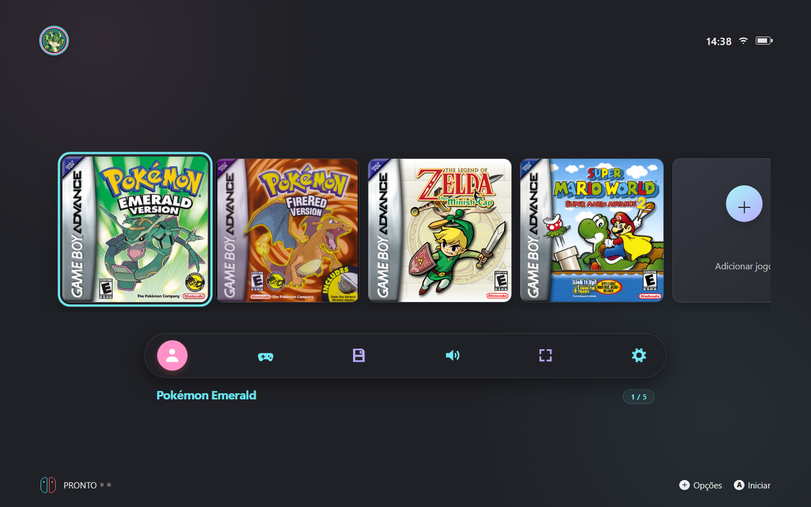
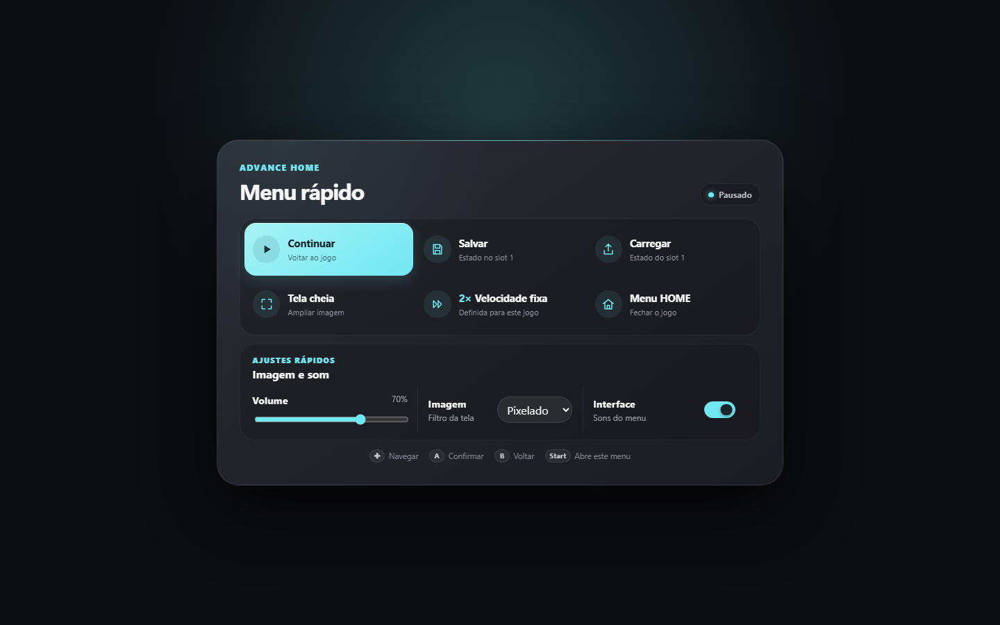
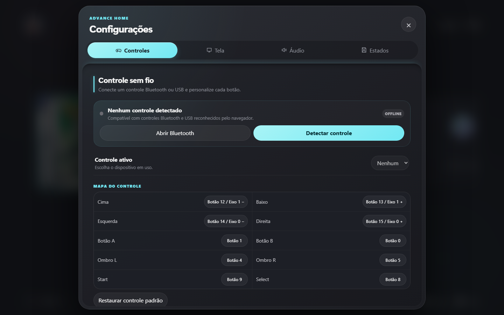
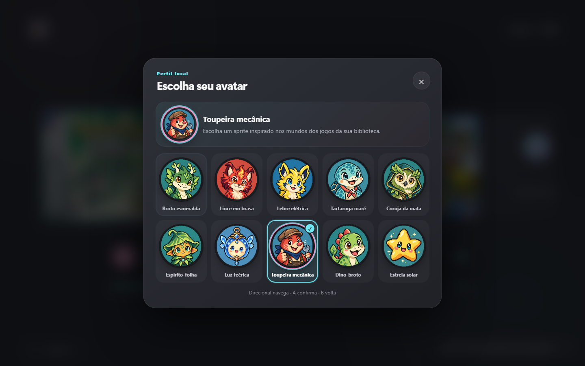
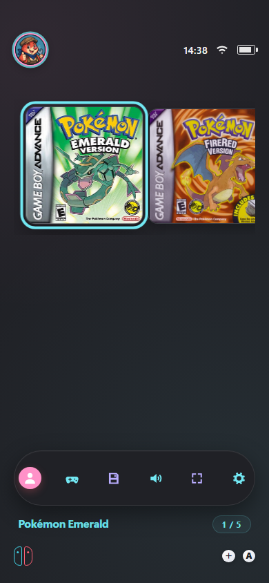
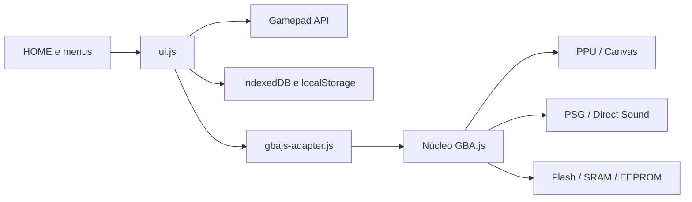

<div align="center">
  
  <h1>GBAOne</h1>
  <p><strong>Emulação de Game Boy Advance no navegador com uma HOME feita para controle.</strong></p>
  <p>Biblioteca visual, save states, áudio, tela cheia e controles personalizáveis — tudo processado localmente.</p>

  <p>
    <a href="https://indraa-x.github.io/gba-emulator/"></a>
    <a href="https://github.com/Indraa-x/gba-emulator/actions/workflows/pages.yml"></a>
    
    
  </p>

  <a href="https://indraa-x.github.io/gba-emulator/">
    
  </a>
</div>

> [!IMPORTANT]
> O projeto não distribui ROMs comerciais nem BIOS proprietária. Use somente cópias de jogos obtidas legalmente. ROMs, saves e preferências permanecem no seu navegador.

## Conheça a interface

<table>
  <tr>
    <td width="50%" align="center">
      <strong>Menu rápido durante o jogo</strong><br><br>
      
    </td>
    <td width="50%" align="center">
      <strong>Configurações completas</strong><br><br>
      
    </td>
  </tr>
</table>

<table>
  <tr>
    <td width="68%" align="center">
      <strong>10 avatares locais</strong><br><br>
      
    </td>
    <td width="32%" align="center">
      <strong>Layout responsivo</strong><br><br>
      
    </td>
  </tr>
</table>

## Destaques

| Experiência | Emulação e dados |
| --- | --- |
| HOME horizontal navegável por controle | Núcleo GBA.js executado inteiramente no navegador |
| Capas personalizadas sem cortes ou deformações | Flash, SRAM e EEPROM persistidos no IndexedDB |
| Menu rápido com volume, filtro e tela cheia | Cinco save states independentes por jogo |
| Teclado e gamepad totalmente remapeáveis | Áudio PSG e Direct Sound com controle por canal |
| Controles Bluetooth ou USB pela Gamepad API | Pokémon em 2×; Zelda e Mario em 1× |
| Temas Ciano e Coral e 10 avatares em pixel art | Sem upload de ROMs, saves ou estados |

Os sons da interface são originais e sintetizados localmente pela Web Audio API. Eles podem ser desligados em **Configurações → Áudio → Sons do menu**.

## Jogar

### No navegador

1. Acesse **[indraa-x.github.io/gba-emulator](https://indraa-x.github.io/gba-emulator/)**.
2. No primeiro acesso, a HOME mostra somente **Adicionar jogo**.
3. Selecione sua cópia `.gba`.
4. A ROM e sua capa ficam salvas somente no IndexedDB desse navegador e passam a aparecer na HOME nas próximas visitas.

### No computador

1. Execute **`Iniciar GBAOne.cmd`**.
2. A HOME abrirá em `http://127.0.0.1:8765/`.
3. Use **Adicionar jogo** e escolha uma ROM `.gba`; ela continuará disponível nesse navegador.

Também é possível iniciar manualmente:

```powershell
node local-server.js
```

Abrir `index.html` diretamente por `file://` não permite que o navegador leia automaticamente ROMs vizinhas. Nesse modo, use **Adicionar jogo**.

## Controles

| GBA | Teclado padrão |
| :--- | :---: |
| Direcional | Setas |
| A / B | X / Z |
| L / R | A / S |
| Start | Enter |
| Select | Shift esquerdo |
| Menu rápido | Shift esquerdo (Select) ou Esc |

Na interface, use o direcional ou analógico para navegar, **A** para confirmar, **B** para voltar e **L/R** para trocar abas. Durante o jogo, **Select** abre o menu rápido e **Start** permanece dedicado ao jogo. Todos os botões podem ser alterados em **Configurações → Controles**.

## Arquitetura



O núcleo livre **GBA.js**, criado por Jeffrey Pfau, cuida da CPU ARM7TDMI, memória, vídeo, áudio e cartucho. O `gbajs-adapter.js` conecta o núcleo à interface e ao armazenamento local. A implementação educacional original permanece em `js/core/` como referência.

## Testes

```powershell
node tests/static-smoke.js
node tests/gamepad-smoke.js
node tests/speed-smoke.js
node tests/rom-compatibility-smoke.js
node tests/pokemon-smoke.js
node tests/layout-browser-smoke.js
node tests/browser-smoke.js
```

Os testes cobrem integridade da interface, controles, compatibilidade de ROMs, velocidade, áudio, renderização, estados, armazenamento e layouts desktop/mobile. As ROMs usadas localmente nos testes são ignoradas pelo Git e nunca fazem parte do repositório.

## Compatibilidade

Pokémon Emerald, Pokémon FireRed, The Legend of Zelda: The Minish Cap e Super Mario Advance 2 são os principais jogos de regressão deste projeto. Periféricos incomuns, link multiplayer, sensores específicos e jogos com timing atípico ainda podem exigir melhorias.

Save states devem ser usados com a mesma versão do projeto e a mesma ROM.

## Privacidade e licença

- ROMs, saves, estados, capas geradas e preferências ficam no dispositivo do usuário.
- Limpar os dados do site no navegador remove o conteúdo armazenado localmente.
- O núcleo GBA.js é distribuído sob a licença BSD de 2 cláusulas; consulte [`vendor/gbajs/COPYING`](vendor/gbajs/COPYING).
- Game Boy Advance, Pokémon, Zelda, Mario e Nintendo são marcas de seus respectivos proprietários.
- GBAOne é um projeto independente, sem afiliação ou endosso da Nintendo.

<div align="center">
  <strong>Feito para estudar emulação, interfaces e preservação de jogos.</strong><br>
  <a href="https://indraa-x.github.io/gba-emulator/">Abrir o GBAOne</a>
</div>
